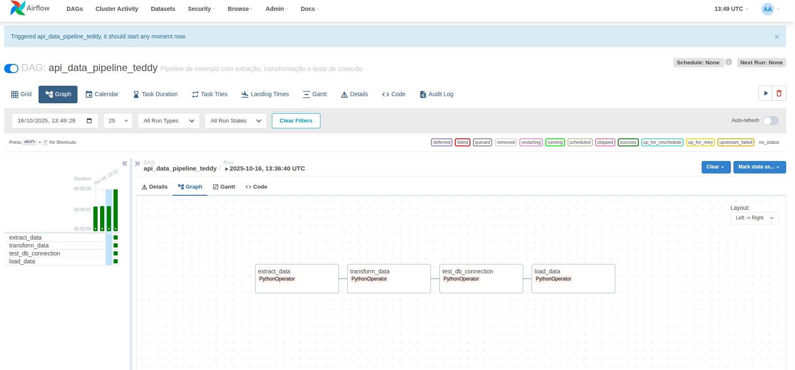
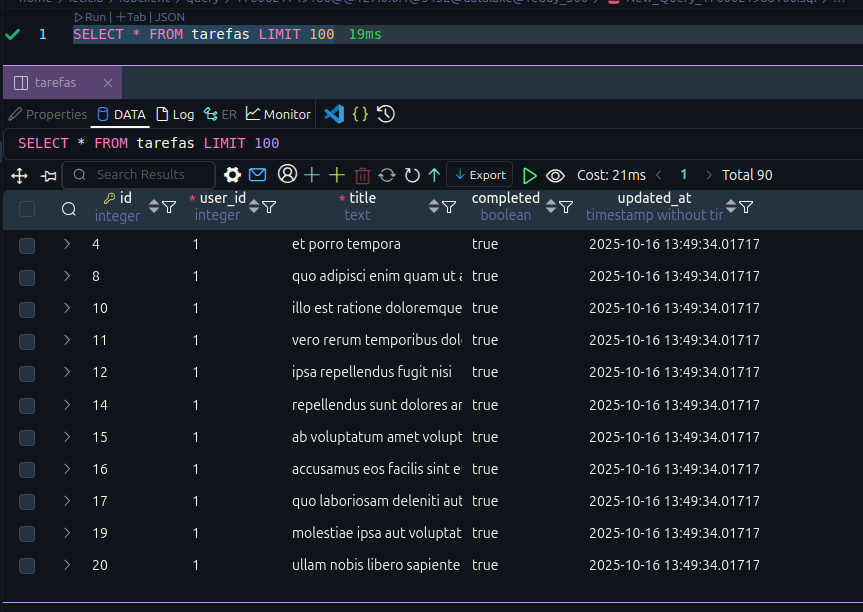

# Desafio Técnico – Engenheiro de Dados | Teddy Open Finance  
**Pipeline de Dados com Airflow e PostgreSQL**

Este projeto implementa um pipeline de dados automatizado utilizando **Apache Airflow**, que coleta dados de uma API pública, transforma e carrega apenas registros completos no **Data Lake**, armazenado no schema `Teddy_360` de um banco **PostgreSQL**.

---

## 📸 Visão Geral

### DAG no Airflow  
> Imagem da DAG executada com sucesso



### Tabela no Banco  
> Estrutura da tabela `tarefas` no schema `Teddy_360`



---

## 🎯 Objetivos do Projeto

- Coletar os dados da API e armazená-los no Data Lake, no schema `Teddy_360` do banco de dados PostgreSQL.
- Garantir que apenas linhas de dados **completas** sejam armazenadas. Linhas incompletas são excluídas.
- Criar a string de conexão da engine utilizando SQLAlchemy.
- Criar o script SQL para estruturação da tabela.
- Realizar o versionamento com Git, mantendo organização e semântica nos commits.

---

## 🛠️ Tecnologias Utilizadas

- Apache Airflow
- PostgreSQL
- Python 3.12
- Docker
- Bibliotecas:
  - `requests`
  - `pandas`
  - `SQLAlchemy`
  - `python-dotenv`
  - `psycopg2-binary`
  - `pytest` (para testes unitários)

---

## 🐳 Como Rodar com Docker

```bash
# Clone o repositório
git clone https://github.com/seu-usuario/desafio-teddy.git
cd desafio-teddy

# Para este case, o arquivo `.env` foi mantido localmente e está ignorado via `.gitignore`.

# Suba os containers com Docker Compose
docker-compose up --build
```
Acesse o Airflow em: http://localhost:8080

## 🧪 Como Rodar os Testes

### Ative a virtualenv
source venv/bin/activate

### Instale as dependências
pip install -r requirements.txt

### Rode os testes
pytest
Todos os testes estão localizados na pasta tests/ e cobrem os módulos de extração, transformação e carga de dados.

---

## 📁 Estrutura do Projeto
```bash
Código
desafio-teddy/
├── dags/
│   └── api_data_pipeline.py
├── src/
│   ├── extract.py
│   ├── transform.py
│   └── loading.py
├── tests/
│   ├── test_extract.py
│   ├── test_transform.py
│   └── test_load.py
├── data/
│   ├── raw_data.json
│   └── filtered_data.json
├── images/
│   ├── dag_airflow.png
│   └── tabela_tarefas.png
├── .env
├── requirements.txt
└── README.md
```

---

## 🏗️ Arquitetura e Estratégia de Dados
O pipeline foi desenvolvido com foco em simplicidade, modularidade e escalabilidade, respeitando boas práticas de engenharia de dados.

Arquitetura
Orquestração com Apache Airflow: cada etapa do pipeline (extração, transformação e carga) é representada como uma task independente, permitindo rastreabilidade e reprocessamento.

Armazenamento em Data Lake PostgreSQL: os dados são persistidos no schema Teddy_360, isolando o contexto do projeto e facilitando futuras análises.

Modularização em Python: os scripts foram separados em módulos (extract.py, transform.py, loading.py) para facilitar manutenção e testes.

Testes automatizados com Pytest: cada módulo possui testes unitários que garantem a integridade das funções principais.

Estratégia de Dados
Filtragem de registros incompletos: o campo completed foi utilizado como critério de integridade. Registros com completed = False foram considerados incompletos e excluídos na etapa de transformação.

Evita duplicações: antes de inserir dados no banco, o pipeline verifica se o id da tarefa já existe, garantindo que apenas dados novos sejam carregados.

Versionamento com timestamp: cada registro inserido recebe um campo updated_at, permitindo rastrear atualizações e facilitar auditorias.

Uso de variáveis de ambiente: a conexão com o banco é configurada via .env, promovendo segurança e flexibilidade entre ambientes.